# Agent Factory Architecture Documentation

## Table of Contents
1. [System Overview](#system-overview)
2. [High-Level Architecture](#high-level-architecture)
3. [Core Components](#core-components)
4. [Class Diagrams](#class-diagrams)
5. [Data Flow Architecture](#data-flow-architecture)
6. [Profile Personalization System](#profile-personalization-system)
7. [Memory Management System](#memory-management-system)
8. [Tool System Architecture](#tool-system-architecture)
9. [Configuration Management](#configuration-management)
10. [Web Interface Architecture](#web-interface-architecture)
11. [Database Integration](#database-integration)
12. [Deployment Architecture](#deployment-architecture)
13. [Technical Implementation Details](#technical-implementation-details)

## System Overview

Agent Factory is a sophisticated AI agent platform that has been transformed into **Emreq** - a personalized AI Engineering Manager. The system provides:

- **Personalized AI Interactions** using Supabase profile integration
- **Memory Management** with intelligent LLM-based extraction
- **Tool Integration** including web search and calendar scheduling
- **Modern Web Interface** using Chainlit with real-time streaming
- **Configuration-Driven Architecture** for flexible agent customization

### Key Technologies
- **Backend**: Python 3.11+, Pydantic, OpenAI GPT-4-turbo
- **Database**: Supabase (PostgreSQL) with Row Level Security
- **Web Interface**: Chainlit (FastAPI-based) with WebSocket streaming
- **Authentication**: Supabase Auth with JavaScript bridge
- **Configuration**: YAML-based with validation
- **Tools**: Extensible plugin architecture

### System Capabilities
- **Phase 1 Personalization**: Profile-based personalized welcome messages and context
- **Intelligent Memory**: LLM-powered extraction of user information with confidence scoring
- **Tool Ecosystem**: Calculator, file reader, web search, calendar scheduling
- **Streaming Responses**: Real-time chat with WebSocket streaming
- **Enterprise Ready**: Security, error handling, and scalable architecture

## High-Level Architecture

The system follows a layered architecture pattern with clear separation of concerns:

**Frontend Layer**: Chainlit web interface with JavaScript authentication bridge
**Application Layer**: Core agent logic, memory management, and tool orchestration  
**Core Layer**: Configuration, LLM abstraction, and registry systems
**Data Layer**: Supabase database, YAML configs, and environment variables
**External Services**: OpenAI API, web search, and email services

This architecture enables:
- **Modularity**: Each layer can be modified independently
- **Scalability**: Components can be scaled horizontally
- **Testability**: Clear interfaces enable comprehensive testing
- **Maintainability**: Well-defined responsibilities reduce complexity

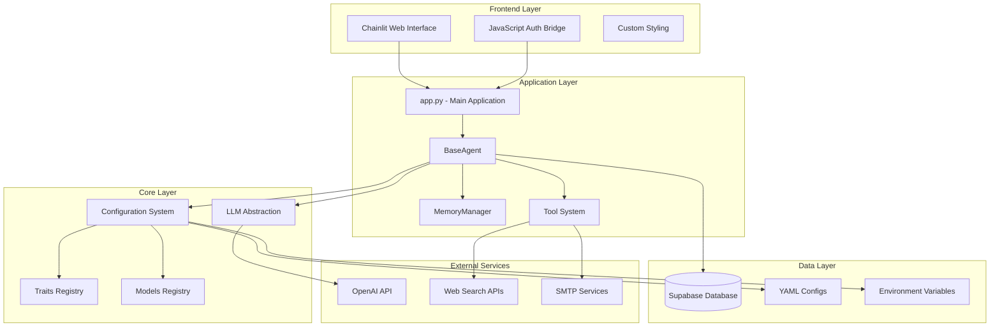

## Core Components

### 1. BaseAgent (`agent_factory/agent.py`)
The central orchestrator that manages all agent interactions, memory, and tools.

**Key Responsibilities:**
- Chat message processing with streaming support
- Memory management integration
- Tool execution and coordination
- Profile personalization injection
- LLM interaction management

### 2. MemoryManager (`agent_factory/agent.py`)
Intelligent memory system that tracks user profiles, goals, and conversation history.

**Key Features:**
- LLM-based information extraction with confidence scoring
- Profile data injection from Supabase
- Conversation summarization
- Goal tracking and management

### 3. SupabaseProfileClient (`agent_factory/supabase_client.py`)
Handles all database interactions for user profile management.

**Key Features:**
- Row Level Security (RLS) bypass using service role
- Profile data formatting for agent consumption
- Session token validation
- Personalized context generation

### 4. Configuration System (`agent_factory/config.py`)
YAML-based configuration with comprehensive validation.

**Key Features:**
- Pydantic model validation
- API key availability checking
- Traits and models registry integration
- Environment variable management

## Class Diagrams

### Core Agent Architecture

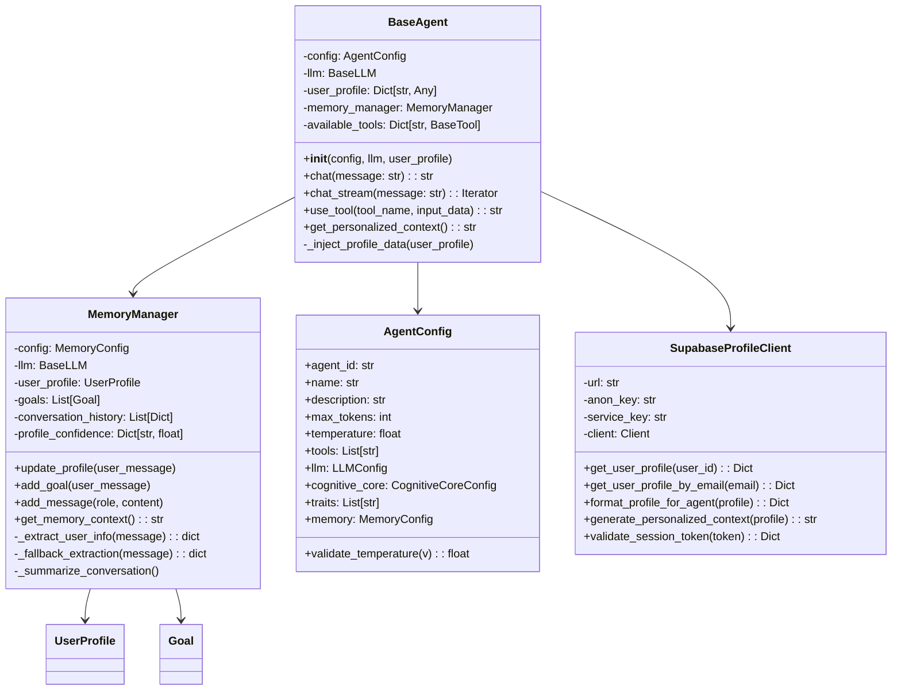

### Tool System Architecture

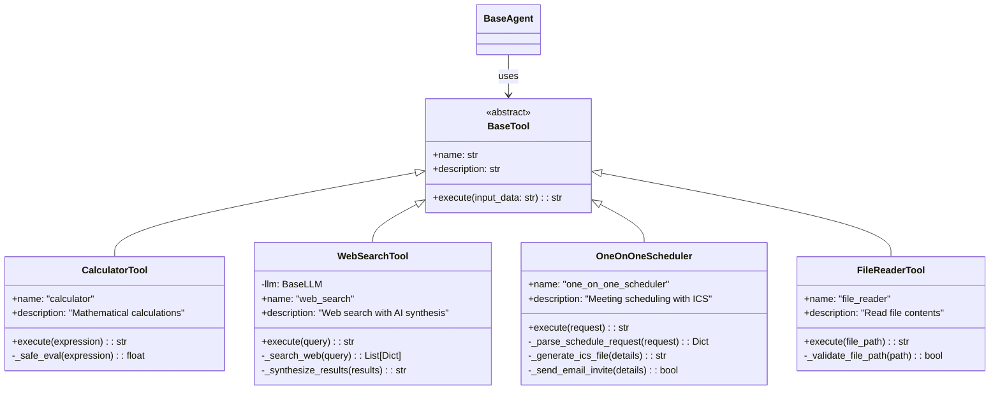

### Configuration System

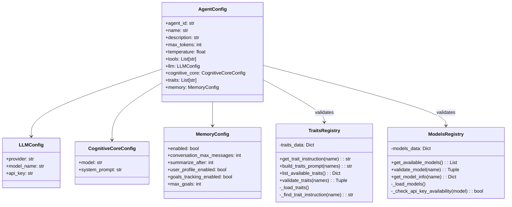

## Data Flow Architecture

### Chat Message Processing Flow

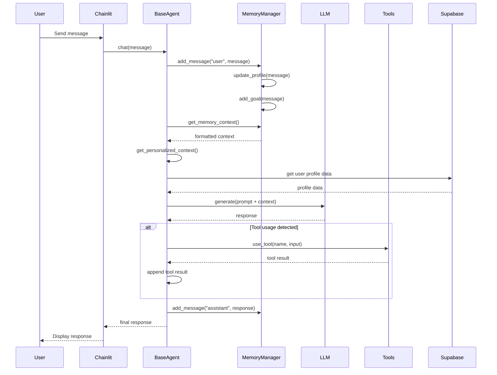

### Profile Loading and Personalization Flow

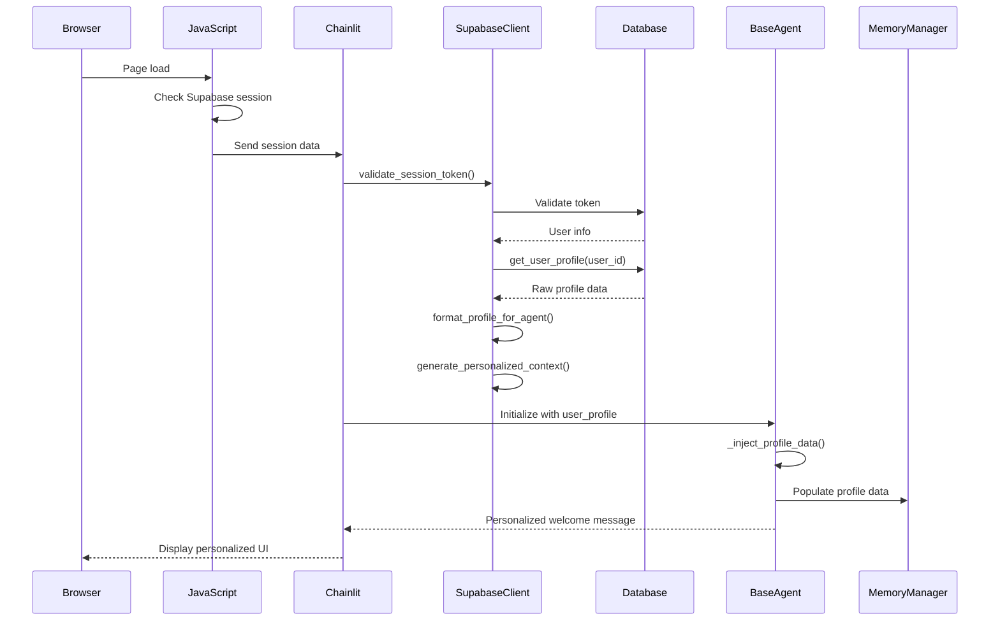

## Profile Personalization System

### Architecture Overview

The profile personalization system enables **Phase 1 Personalization** where loaded profiles provide personalized first chat messages and context throughout conversations.

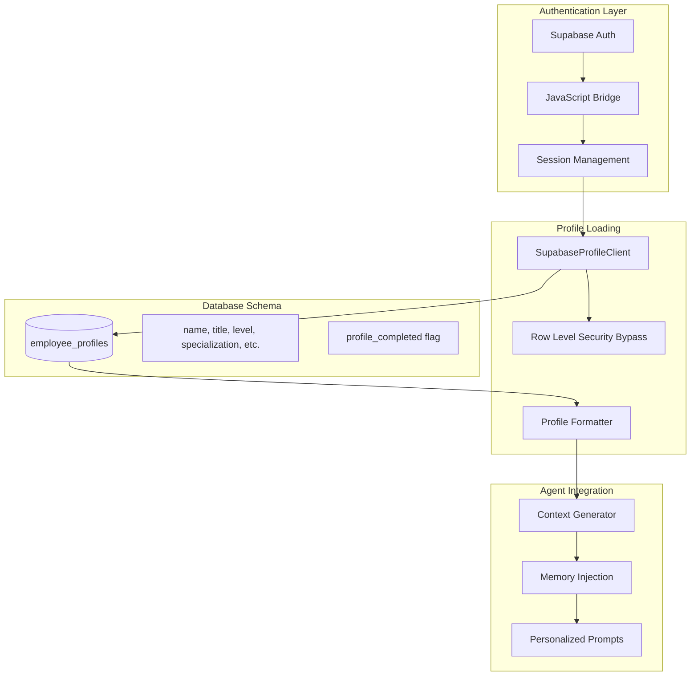

### Key Features

1. **Seamless Authentication Bridge**: JavaScript Supabase auth communicates with Python backend
2. **RLS Bypass**: Service role key bypasses Row Level Security for backend operations
3. **Profile Context Injection**: User data flows into memory system and chat prompts
4. **Personalized Welcome Messages**: Dynamic greetings based on user profile data
5. **Continuous Personalization**: Profile data available throughout conversation

### Database Schema

```sql
CREATE TABLE employee_profiles (
    id UUID PRIMARY KEY REFERENCES auth.users(id),
    email TEXT NOT NULL,
    name TEXT,
    title TEXT,
    level TEXT,
    team TEXT,
    years_experience INTEGER,
    years_at_company INTEGER,
    specialization TEXT,
    tech_skills TEXT[],
    current_projects TEXT[],
    career_goals TEXT[],
    biggest_challenges TEXT[],
    strengths TEXT[],
    learning_goals TEXT[],
    communication_style TEXT,
    feedback_frequency TEXT,
    meeting_style TEXT,
    profile_completed BOOLEAN DEFAULT FALSE,
    created_at TIMESTAMPTZ DEFAULT NOW(),
    updated_at TIMESTAMPTZ DEFAULT NOW()
);
```

## Memory Management System

### Architecture Overview

The V1 Memory System provides intelligent user profile extraction, goal tracking, and conversation management.

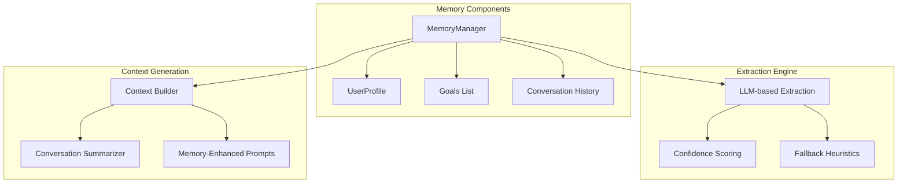

### Key Features

1. **Intelligent Extraction**: Uses GPT-4-turbo for extracting names, roles, communication styles
2. **Confidence Scoring**: 0.0-1.0 confidence scores prevent overwriting high-quality data
3. **Goal Tracking**: Automatically detects and tracks user goals with deduplication
4. **Conversation Summarization**: Maintains context while staying within token limits
5. **Profile Injection**: Seamlessly integrates Supabase profile data

## Tool System Architecture

### Plugin Architecture

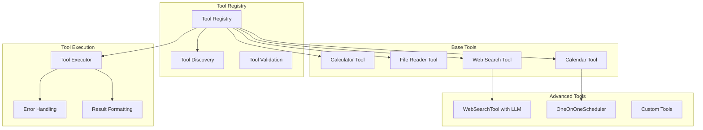

### Tool Integration Pattern

```python
# Tool Registration Pattern
_TOOLS: Dict[str, BaseTool] = {
    "calculator": CalculatorTool(),
    "file_reader": FileReaderTool(),
    "web_search": WebSearchTool(),  # Re-initialized with LLM
    "one_on_one_scheduler": OneOnOneScheduler()
}

# LLM-Enhanced Tool Pattern
class WebSearchTool(BaseTool):
    def __init__(self, llm: Optional[BaseLLM] = None):
        self.llm = llm
    
    def execute(self, query: str) -> str:
        # Use LLM for intelligent query processing
        # and result synthesis
```

## Configuration Management

### YAML-Based Configuration

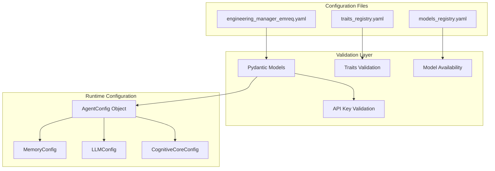

### Configuration Structure

```yaml
# engineering_manager_emreq.yaml
agent_id: "emreq"
name: "Emreq"
description: "AI Engineering Manager"

cognitive_core:
  model: "gpt-4-turbo"
  system_prompt: |
    You are Emreq, a ruthless AI engineering manager...

tools:
  - web_search
  - one_on_one_scheduler

traits:
  - sarcasm
  - ruthless_efficiency
  - tough_love
  - results_focused

memory:
  enabled: true
  conversation_max_messages: 50
  user_profile_enabled: true
  goals_tracking_enabled: true
```

## Web Interface Architecture

### Chainlit Integration

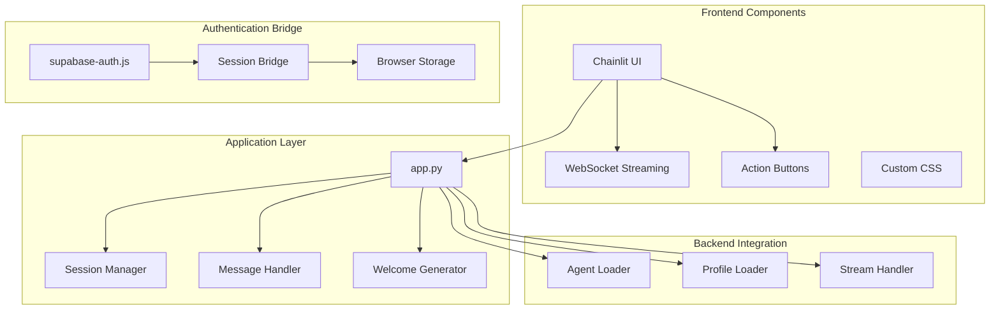

### Key Features

1. **Real-time Streaming**: WebSocket-based streaming for responsive interactions
2. **Custom Styling**: Dark theme with JetBrains Mono fonts and green accents
3. **Action Buttons**: Quick access to common engineering manager functions
4. **Session Management**: Seamless Supabase auth integration
5. **Responsive Design**: Modern, professional interface

## Database Integration

### Supabase Architecture

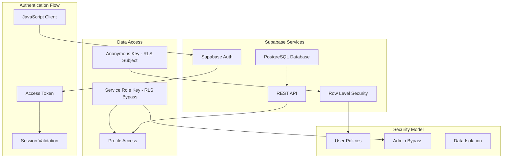

### Security Model

1. **Row Level Security (RLS)**: Protects user data at the database level
2. **Service Role Key**: Backend uses service role to bypass RLS for system operations
3. **Session Validation**: Tokens validated against Supabase auth
4. **Data Isolation**: Users can only access their own profile data

## Deployment Architecture

### Development Environment

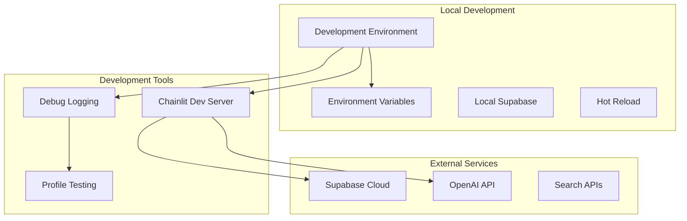

### Production Considerations

1. **Environment Variables**: Secure API key management
2. **Database Connection Pooling**: Efficient Supabase connections
3. **Error Handling**: Comprehensive error logging and recovery
4. **Performance Monitoring**: Response time and token usage tracking
5. **Security**: HTTPS, secure session management, data encryption

## Technical Implementation Details

### Key Design Patterns

1. **Factory Pattern**: Agent creation through configuration
2. **Strategy Pattern**: Multiple LLM providers support
3. **Observer Pattern**: Memory system updates
4. **Plugin Architecture**: Extensible tool system
5. **Singleton Pattern**: Registry management

### Performance Optimizations

1. **Lazy Loading**: Tools and registries loaded on demand
2. **Connection Pooling**: Efficient database connections
3. **Caching**: Configuration and profile data caching
4. **Streaming**: Real-time response streaming
5. **Token Management**: Efficient prompt construction

### Error Handling Strategy

1. **Graceful Degradation**: Fallback to basic functionality
2. **Comprehensive Logging**: Debug information at all levels
3. **User-Friendly Messages**: Clear error communication
4. **Recovery Mechanisms**: Automatic retry and fallback
5. **Monitoring**: Error tracking and alerting

## Future Architecture Considerations

### Phase 2: Dynamic Profile Updates
- Real-time profile updates based on conversation insights
- ML-based preference learning
- Behavioral pattern recognition

### Phase 3: Advanced Personalization
- Adaptive communication style matching
- Context-aware response generation
- Multi-modal interaction support

### Phase 4: Enterprise Features
- Multi-tenant architecture
- Advanced analytics and reporting
- Integration with enterprise tools
- Scalable deployment options

---

This architecture document provides a comprehensive overview of the Agent Factory system transformed into Emreq. The modular design, comprehensive error handling, and extensible architecture make it suitable for both current personalization features and future enterprise enhancements. 